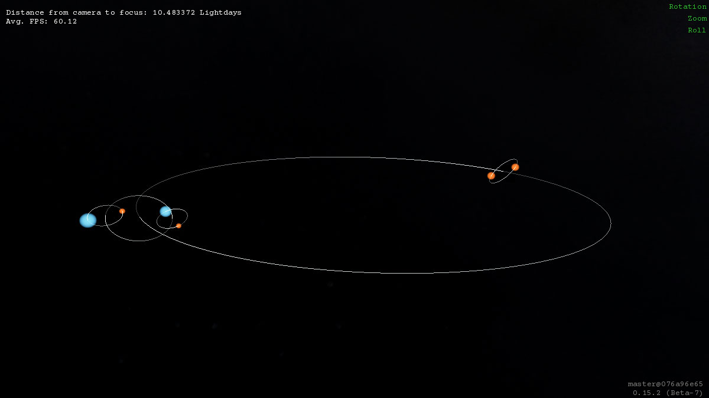

# Castor System

Makes a multiple star system based on a csv File


(group, name, parent, e eccentricity, a semimajor [AU], i inclination [deg], Ω ascendingnode [deg], ω argumentofperiapsis [deg], meananomaly, epoch, T period [yrs],starScale [0 to 1], star Texture file)

These two nodes will be the AB and C objects. They have the System Center as the parent, and only the trails are visible.
```
group,CastorAB,CastorSystemCenter,.3,1000,34,0,0,0.0,2000 1 1 00:00:00,14000,1,black.png
group,CastorC,CastorSystemCenter,.3,1000,34,0,0,180,2000 1 1 00:00:00,14000,1,black.png
```

The two nodes are Castor Ca and Cb, with parents = CastorC, from above.

```
group,CastorCa,CastorC,0,100,90,0,0,0,2000 1 1 00:00:00,0.002230137,.5,orange_fuzz.png
group,CastorCb,CastorC,0,100,90,0,0,180,2000 1 1 00:00:00,0.002230137,.5,orange_fuzz.png
```

This group of 3 defines the A group:

```
group,CastorA,CastorAB,0,100,0,0,0,0,2000 1 1 00:00:00,0.002230137,.1,black.png
group,CastorAa,CastorA,0,50,90,0,0,0,2000 1 1 00:00:00,0.002230137,.5,blue_fuzz.png
group,CastorAb,CastorA,0,50,90,0,0,180,2000 1 1 00:00:00,0.002230137,.2,orange_fuzz.png
```

and This groupd of 3 defines the B group:

```
group,CastorB,CastorAB,0,100,0,0,0,180,2000 1 1 00:00:00,0.002230137,.1,black.png
group,CastorBa,CastorB,0,50,90,0,0,0,2000 1 1 00:00:00,0.00802273973,.4,blue_fuzz.png
group,CastorBb,CastorB,0,50,90,0,0,180,2000 1 1 00:00:00,0.00802273973,.2,orange_fuzz.png
```

