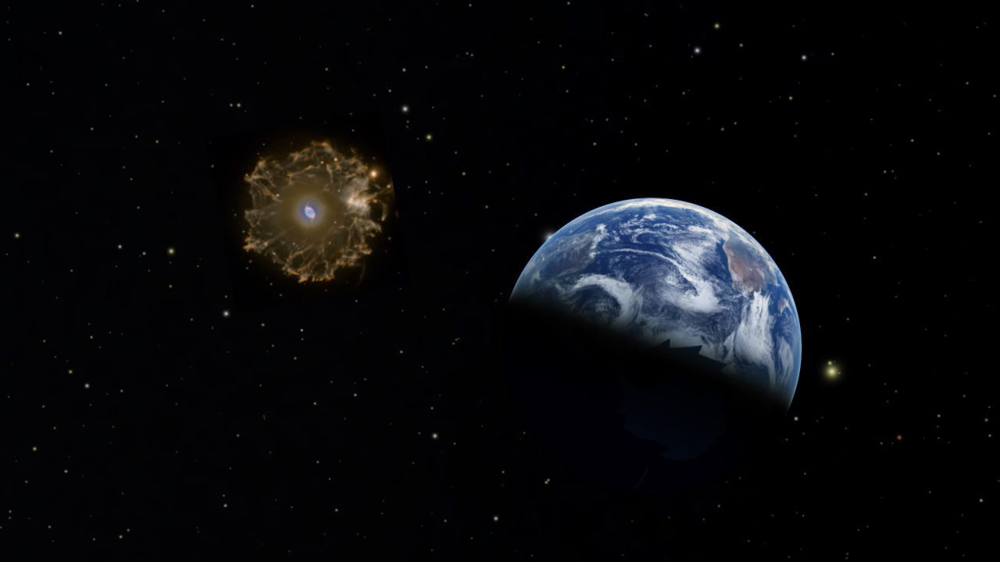

# Add an Image somewhere in space

This asset adds an image to a set position in space.

In this case, we've put an image of the Cat's Eye nebula at its approximate location in space. (It has been enlarged for visibility)

