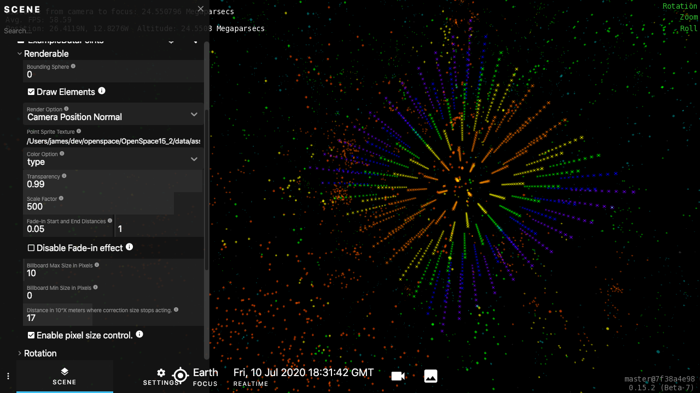

# A sample asset that will load a speck file and place it in a scene.

Request the asset from your scene file by including:

`asset.request('import-example-1/datapoints')`

Assuming you've put this folder directly under the `assets` directory.

`asset.request` will look directly under the `OpenSpace15.x/data/assets` directory, so if you put it elsewhere, you will need to adjust the path in the above command.

The speck file in this examples is a 5x5x5 grid of data points.

The example speck file has 4 columns:

| x | y | z | colorkey |
| : | : | : | : |
|-1 | -3 | 2 | 3 |

A simple colormap is contained in the `colors.cmap` file.

The units are set by the following line in the `datapoints.asset` file:

`Unit = "Mpc",`

The results should look like the following:

(but will only be visible when the camera is zoomed out to the intergalactic scale)
