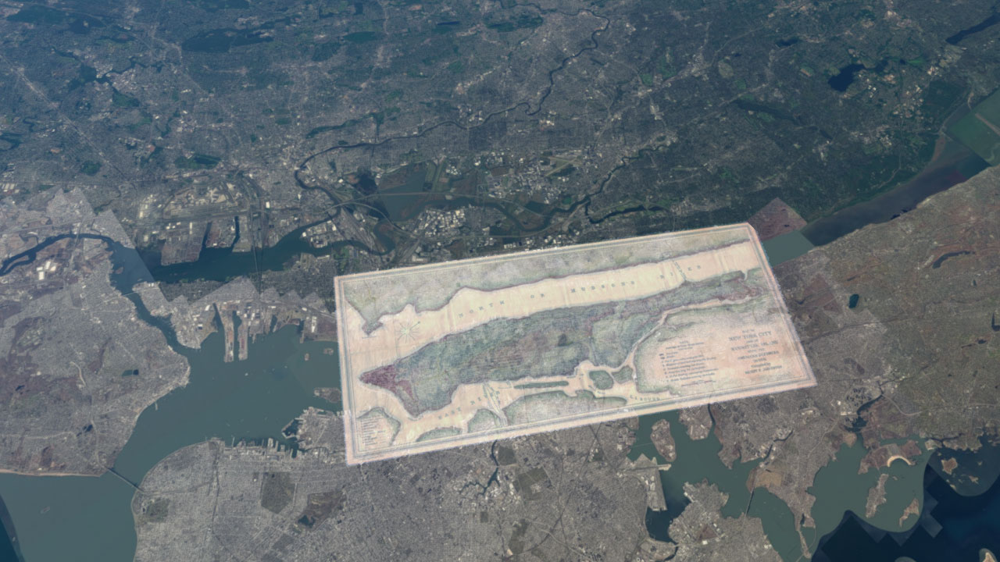
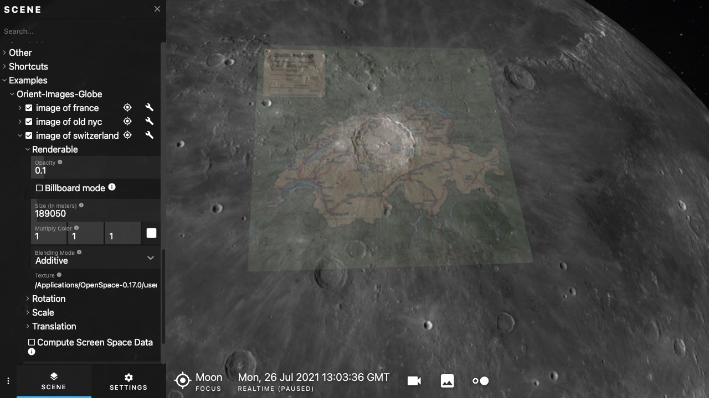

## Orient Image on Globe

### Adds an image to a globe, tangent to the surface at a particular point

The `add-images.asset` will take a square image and put it with its top edge facing north, at a particular lat/long on a globe.

The `globepositions.csv` file contains the data for the images.

### Usage:

Just add the asset to your profile and it should load the image.

Eg: put this whole folder inside the `user/data/assets/` folder.

Then either use the editor to modify the profile to include this asset, or add the following line yourself:

```
"${USER_ASSETS}/orient-image-globe-compare/add-images"
```

You can adjust the opacity of the image in the GuiPath. Or if the scale isn't quite right, that can be adjusted too.

### The CSV File

The CSV file contains the list of images and locations for the images. This way, you could add many images without having to make a new asset for each one, since the `add-images.asset` will go through the table and add each one to the globe it belongs to.

For example:

| Globe | Latitude | Longitude | Label | Width (in m) | File Name
| --- | --- | --- | --- | --- | --- |
| Earth | 40.786617 | -73.955455 | old nyc | 25266.7 | nyc-historic.png |

will add the nyc-historic map to the earth, and put it over the island of of manhattan.

To add more images to the csv file:

You'll need to know the width of the image in meters. So that it is somewhat accurate.

The image needs to have north in the up direction.

A png with transparency will probably be best.

### Positioning

There is vector math in the `add-images.asset` file that will automatically make the image lie tangent to the globe at the chosen lat/long. You can also do that by hand in the gui using the rotation adjusment parameters, but this is much faster and more accurate. It does require the image to be oriented with north pointing up, so you might need to manually prepare the image in that orientation.

### Examples




